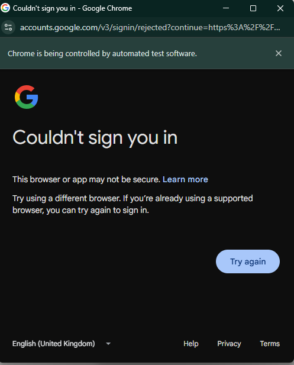

## Automating LinkedIn Job Hunting: A Technical Adventure with Selenium and Chrome

Searching for contract work on LinkedIn can feel like an endless cycle: scroll, click, apply, repeat. Beyond the repetition, there’s also the challenge of keeping track of which roles you’ve applied for, which ones look promising, and which ones are already stale. As a developer, I saw an opportunity: Why not automate this? A scraper, purpose-built to collect job postings directly from LinkedIn, could save untold hours of effort and inject efficiency into the otherwise monotonous task of job-hunting.

The idea was simple—build a scraper that could:

* Collect LinkedIn job posts (particularly those advertising contracts).
* Allow me to quickly apply (or at least prepare for applying).
* Store the results in a structured format (eventually pushing them into a spreadsheet for tracking).

In theory, this would give me a personalized job-hunting dashboard. In practice, it became a crash course in browser automation, authentication quirks, and the invisible walls erected by modern web platforms.

### Step 1: First Attempt with Microsoft Edge

My first attempt was with Microsoft Edge, largely because it ships with Windows and has solid Selenium integration. The setup seemed straightforward: install msedgedriver, point Selenium to it, and open LinkedIn.

Instead of a smooth entry, though, I was greeted by an immediate crash. The browser session terminated before it could load a page, throwing errors about the DevTools port.

Lesson learned: not every browser is equally well-supported, and debugging setup issues can eat more time than it’s worth. At this point, Edge was out.

### Step 2: Reusing My Chrome Profile

Next, I turned to Chrome. The logic was appealing: my Chrome profile already had me logged into LinkedIn, so if I launched Selenium with that profile, I could bypass the login flow entirely. No fiddling with CAPTCHAs, no “Sign in with Google” dialogs—just straight to the content.

Here’s where theory met reality. Chrome refused to cooperate when asked to open my main profile under automation. The errors were cryptic, and the result was always the same: the browser launched but never successfully navigated to LinkedIn.

Lesson learned: Chrome is not designed to let you attach Selenium directly to your main user profile—it’s a security risk, and Google has deliberately made it difficult.

### Step 3: The Profile Duplication Trick

After a round of trial and error, I hit on an idea: copy my profile folder to a new temporary location and point Selenium’s --user-data-dir there.

Surprisingly, this worked. The browser launched, LinkedIn opened, and it recognized my Google profile. My profile picture even appeared in the top corner of the page. For the first time, I felt I was on the cusp of success.

At this point, I could scrape the page source and start parsing content with BeautifulSoup
This was the first real win in the project.

### Step 4: The Authentication Roadblock

And then came the final hurdle: authentication. Clicking Sign in with Google looked like it would complete the circle. Instead, LinkedIn promptly blocked the attempt. Google’s security checks identified the automated environment and refused to authenticate.

That was the end of the line for this iteration. The scraper could load LinkedIn while logged in, but any interaction requiring active authentication was stopped cold.

Lesson learned: platforms like LinkedIn invest heavily in anti-bot defenses. They don’t just check cookies—they monitor interaction patterns, headers, and even automation fingerprints.



## Where to Go From Here

At this stage, I had a partially functioning system: I could open LinkedIn in an automated browser session and see content. The missing piece was sustainability—being able to consistently log in, scrape posts, and track them without hitting roadblocks.

My next steps include:

Exploring undetectable ChromeDriver options, which aim to reduce the automation fingerprints that trigger platform defenses.

Building a pipeline to store scraped posts in a structured format (JSON, CSV, or directly into Google Sheets).

Adding logic to track whether I’ve already applied to a given post, so the system becomes a true job-application tracker, not just a data collector.

## A Note on Ethics and Practicality

Before closing, it’s important to acknowledge the elephant in the room: scraping LinkedIn is against their terms of service. The measures that blocked my automation aren’t arbitrary—they’re intentional safeguards.

For developers considering similar projects, there’s a balance to strike between technical exploration (learning Selenium, browser automation, and data pipelines) and respecting platform boundaries.

In my case, this project is primarily an exercise in technical learning. The long-term vision isn’t just scraping jobs blindly, but creating a workflow that helps me keep track of applications more effectively.

## Technical Roadmap

Here’s a possible milestone-based roadmap for turning this experiment into a more complete tutorial:

Milestone	Goal	Tools / Notes
1. Basic Scraper	Launch Chrome, load LinkedIn, and parse job listings.	Selenium + BeautifulSoup
2. Data Extraction	Extract relevant job details (title, poster, date).	XPath / CSS selectors
3. Storage	Save posts into CSV/JSON for persistence.	pandas or built-in csv
4. Application Tracking	Mark which posts I’ve already applied to.	Add status column in CSV/Sheets
5. Sheets Integration	Push data into Google Sheets for real-time tracking.	gspread / Google Sheets API
6. Automation Refinement	Experiment with stealthier drivers and better session management.	`undetectable-ChromeDriver`
## Final Thoughts

What began as a “simple” project to streamline job hunting became an unexpected deep dive into the realities of modern web automation. While I haven’t yet achieved a fully functioning system, the lessons along the way—about browsers, sessions, authentication, and platform defenses—have been invaluable.

The story isn’t over. The next chapter will focus on refining the approach, experimenting with stealthier automation tools, and ultimately integrating the results into a structured application-tracking pipeline.

Until then, the adventure continues.
## Final Code

```python
import os
import time
import shutil
import tempfile
from pathlib import Path
from contextlib import suppress

from bs4 import BeautifulSoup
from selenium import webdriver
from selenium.webdriver.chrome.service import Service
from selenium.webdriver.chrome.options import Options

# --- CONFIG ---
CHROMEDRIVER_PATH = "./chromedriver.exe"
PROFILE_NAME = "Default"

# Build paths
user_data_dir = Path(os.environ["LOCALAPPDATA"]) / "Google" / "Chrome" / "User Data"
src_profile = user_data_dir / PROFILE_NAME

if not src_profile.exists():
    raise FileNotFoundError(f"Profile folder not found: {src_profile}")

# Create temporary user data directory and copy profile
temp_udd = Path(tempfile.mkdtemp(prefix="chrome-clone-"))
dst_profile = temp_udd / PROFILE_NAME
dst_profile.mkdir(parents=True, exist_ok=True)

# Directories to skip during copy
skip_dirs = {
    "Cache", "Code Cache", "GPUCache", "Service Worker", "IndexedDB", "File System",
    "Storage", "GrShaderCache", "Media Cache", "Network", "Crashpad", "DIPS",
    "OptimizationGuide", "Platform Notifications", "Reporting and NEL"
}

# Copy profile files
for item in src_profile.iterdir():
    if item.name in skip_dirs:
        continue
    dst = dst_profile / item.name
    try:
        if item.is_dir():
            shutil.copytree(item, dst, dirs_exist_ok=True)
        else:
            shutil.copy2(item, dst)
    except Exception:
        pass

# Remove Chrome lock files
for lock in ("SingletonLock", "SingletonCookie", "SingletonSocket"):
    with suppress(Exception):
        (dst_profile / lock).unlink()

# Setup Chrome options
options = Options()
options.add_argument(f"--user-data-dir={temp_udd}")
options.add_argument(f"--profile-directory={PROFILE_NAME}")
options.add_argument("--no-first-run")
options.add_argument("--no-default-browser-check")

# Start driver
service = Service(CHROMEDRIVER_PATH)
driver = webdriver.Chrome(service=service, options=options)
driver.set_window_size(1280, 900)

# Navigate and print page title
driver.get("https://www.linkedin.com/")
time.sleep(2)

soup = BeautifulSoup(driver.page_source, "html.parser")
print("Title:", soup.title.get_text(strip=True) if soup.title else "(no title)")
```