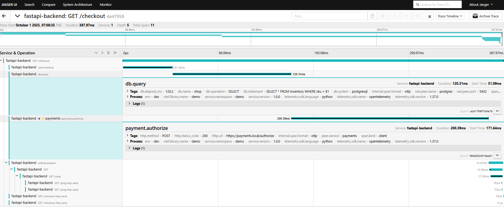

## Repo link
[Github](https://github.com/evotianusx/jaeger-otel-fastapi)
## Tracing FastAPI with OpenTelemetry and Jaeger on Kubernetes
Distributed systems are hard to debug. A single user request often spans multiple services, databases, and third-party APIs. Logs alone rarely capture the full picture. That’s where tracing comes in.
In this post, we’ll walk through integrating FastAPI, OpenTelemetry (OTel), and Jaeger for end-to-end observability, and how to deploy it all on Kubernetes.
## Why Tracing?
* Correlate requests across microservices.
* Measure latency at each hop.
* Pinpoint failures with span-level detail.
* Visualize call graphs inside Jaeger.
## Components
* FastAPI – The backend service we want to trace.
* OpenTelemetry SDK – Captures and exports trace data.
* Collector – Optional pipeline to buffer, process, and forward traces.
* Jaeger – UI for searching and visualizing traces.

### Fast API 
```python
#main.py 
# This is just the snippet, you can find the full file here
import os
import logging
import random
import time
from fastapi import FastAPI
from opentelemetry import trace
from opentelemetry.sdk.trace import TracerProvider
from opentelemetry.sdk.resources import Resource
from opentelemetry.sdk.trace.sampling import ParentBased, TraceIdRatioBased
from opentelemetry.sdk.trace.export import BatchSpanProcessor
from opentelemetry.exporter.otlp.proto.grpc.trace_exporter import OTLPSpanExporter
from opentelemetry.instrumentation.fastapi import FastAPIInstrumentor
from opentelemetry.instrumentation.requests import RequestsInstrumentor
app = FastAPI()
# Configure service name and sampling rate via environment variables
SERVICE_NAME = os.getenv("OTEL_SERVICE_NAME", "fastapi-backend")
SAMPLE_RATIO = float(os.getenv("OTEL_SAMPLING_RATIO", "1.0"))
OTEL_EXPORTER_ENDPOINT = os.getenv("OTEL_EXPORTER_OTLP_ENDPOINT", "http://otel-collector:4317")
# Tracer provider setup
resource = Resource.create({"service.name": SERVICE_NAME})
provider = TracerProvider(
    resource=resource,
    sampler=ParentBased(TraceIdRatioBased(SAMPLE_RATIO)),
)
processor = BatchSpanProcessor(
    OTLPSpanExporter(endpoint=OTEL_EXPORTER_ENDPOINT, insecure=True)
)
provider.add_span_processor(processor)
trace.set_tracer_provider(provider)
# Instrument FastAPI and Requests
FastAPIInstrumentor.instrument_app(app)
RequestsInstrumentor().instrument()
@app.get("/hello")
def hello():
    time.sleep(random.uniform(0.1, 0.5))
    return {"msg": "hello traced world"}
```

### Deploying Jaeger and the OTel Collector
#### Option 1 – Direct Export
FastAPI exports directly to Jaeger. Simple, but harder to scale.
#### Option 2 – Collector Fan-out
FastAPI exports to the OTel Collector, which can fan out to Jaeger, Prometheus, or a SaaS APM. Recommended for production.

### Kubernetes deployment with Helm or manifests:
[Deployment Files](https://github.com/evotianusx/jaeger-otel-fastapi/tree/main/deployment)

## Visualizing Traces
Once running, open Jaeger’s UI (default at http://localhost:16686) and search for your service name (fastapi-backend).
You’ll see:
* Trace timelines per request.
* Span breakdowns with latency.
* Call graphs across services.

## Sample Dash

* Note here that the call to the dummy "payment" service is tracked, we can add different events, and errors as needed
* I also added a call to another endpoint on the same fast-api just to check whether it can fully continue the trace ID, in the `/ping` end point note that i did not put any span tracer, but it got recorded too

## Key Takeaways
* Use OTel SDK inside FastAPI for instrumentation.
* Export traces either directly or through a Collector.
* Collector fan-out gives flexibility to send traces to Jaeger, Prometheus, or cloud APMs.
* Jaeger provides the UI to analyze traces and speed up debugging.
* No ned to use Perfcounter to count how long a function takes, it is automatically calculated for each of the spans
## Next Steps
* Add logging and metrics via OTel for a complete observability stack.
* Integrate with Grafana Tempo or Elastic APM if Jaeger isn’t enough.
* Automate Kubernetes deployment with Helm charts.