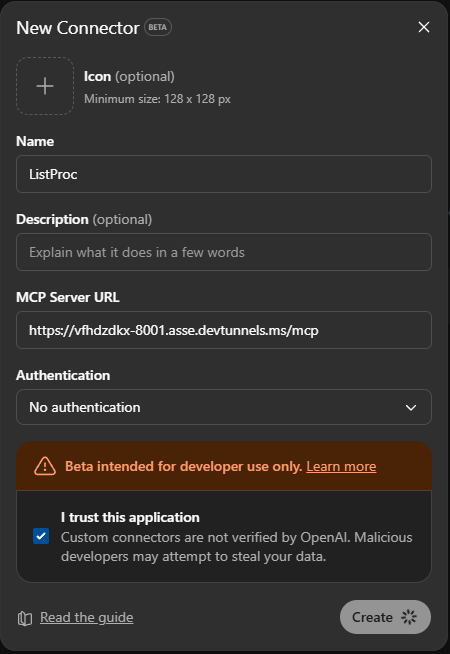
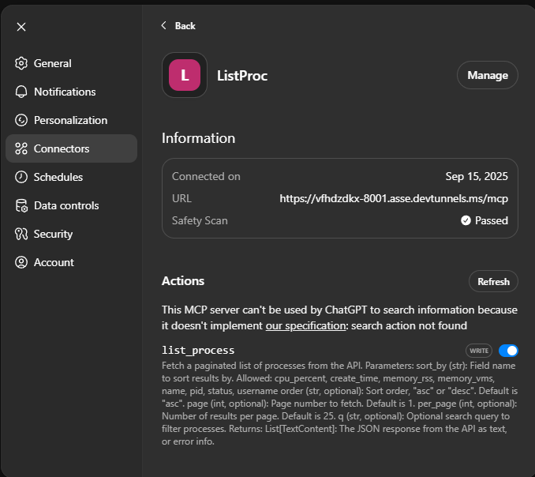

## Why?

Traditionally, you had to use the OpenAI API key directly to let GPT call external tools. With **Model Context Protocol (MCP)**, you can expose your own servers and tools to ChatGPT without hardcoding everything into your app.

For example, here’s how you can connect an MCP server and run process-monitoring tools programmatically:

```python
from dotenv import load_dotenv
from agents.mcp import MCPServerStdio
from agents import Agent, Runner, trace

load_dotenv(override=True)

fetch_params = {"command": "uv", "args": ["run", "mcp.py"], "env": {}}

async with MCPServerStdio(
    params=fetch_params, client_session_timeout_seconds=60, name="ha"
) as server:
    fetch_tools = await server.list_tools()

print(fetch_tools)

instructions = """
You are SysMon, an operations-savvy assistant that inspects local processes via an MCP tool.

Guidelines:
1. When the user asks “top N by memory/cpu”, call list_processes with per_page=N, page=1 and the correct sort_by.
2. Prefer server-side sorting (sort_by + order) over client-side sorting.
3. Always include PID in summaries. Report memory in MB and CPU% when available.
4. If more rows are needed, request subsequent pages.
5. If the user names an app (e.g., “chrome”), pass q="chrome".

Respond concisely with a short table and 1–2 bullet insights. Always state which sort key and page size were used.
"""

async with MCPServerStdio(
    params=fetch_params, client_session_timeout_seconds=60, name="ha"
) as server:
    agent = Agent(
        name="investigator",
        instructions=instructions,
        model="gpt-4.1-mini",
        mcp_servers=[server],
    )
    with trace("SYS MONitor"):
        # This triggers an API call and consumes credits (beyond your ChatGPT subscription).
        result = await Runner.run(
            agent,
            "Show me the current processes",
        )
        print(result.final_output)
```

---

## How?

Follow these steps to integrate your MCP server with ChatGPT Developer Mode.

1. **Create an MCP server**  
   Refer to [this example](/projects/mcp/system-process/) for setup instructions.

2. **Run the MCP server**  
   Example command:  
   ```bash
   uv run fastmcp run mcp2.py:mcp --transport http --port 8001
   ```

3. **Enable Developer Mode in ChatGPT**  
   See [the official guide](https://platform.openai.com/docs/guides/developer-mode).

4. **Expose your local MCP server**  
   - If using VSCode, go to the **PORTS** tab and expose the server port.  
   - Tools like **Ngrok** provide a more stable tunnel for external access.

5. **Add a new connector in ChatGPT**  
   - Append `/mcp` to the end of your public URL.  
   - Example: `https://<your-ngrok-domain>/mcp`  
   - 

6. **Verify tools are visible**  
   - You should see the registered tools listed inside ChatGPT.  
   - 

7. **Create a new chat session**  

8. **Enable Developer Mode + Connector**  
   - In the left sidebar, click the **Plus (+)** sign.  
   - Toggle on Developer Mode and enable your connector.

9. **Start prompting**  
   Example prompt:  
   ```text
   Use the list_process tool and generate a table (include the cmdline).  
   Then give 3 bullet-point insights on memory usage.
   ```

10. **Validate responses**  
    ChatGPT should call the MCP tool, then analyze and summarize the process data.  
    Example shared output: [see here](https://chatgpt.com/share/68c76fc1-28f8-8002-aa6d-d21274188a40)

---

## Notes

- MCP allows you to securely integrate your own local or remote tools into ChatGPT.  
- Every MCP tool call triggers an API request and consumes credits.  
- Use server-side filtering and pagination for efficiency.  
- Exposing a local server requires tunneling if ChatGPT cannot access it directly.  
